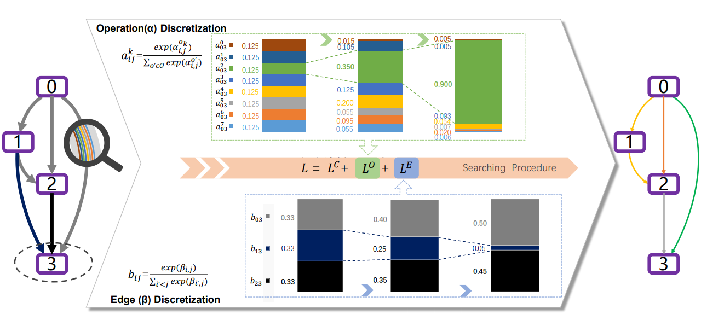
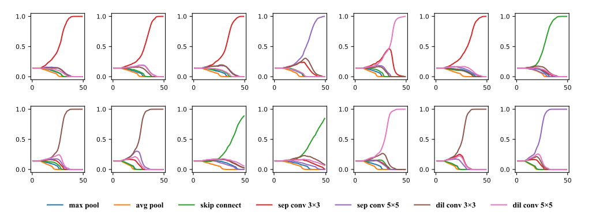
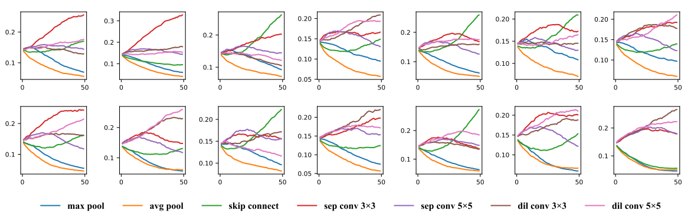

# Discretization-Aware Architecture Search

**DAAS has been accepted by [PR(2021)](https://www.sciencedirect.com/science/article/pii/S0031320321003733)， [arxiv:](https://arxiv.org/pdf/2007.03154.pdf).

Weight-sharing methods determine sub-networks by discretization, i.e. by pruning off weak candidates, and the discretization process incurs signficant inaccuracy. We propose discretization-aware architecture search to alleviate this issue. The main idea is to introduce an additional term to the loss function, so that the architectural parameters of the super-network is gradually pushed towards the desired configuration during the search process.
<p align="center">
  
</p>
<p align="center">
Figure 1: Pipeline of DA2S
</p>
The algorithm is based on continuous relaxation and gradient descent in the architecture space. Only a single GPU is required.

## Requirements
```
Python == 3.6, PyTorch == 0.4
```

## Datasets
CIFAR-10 and Imagenet.

## Architecture search
To carry out architecture search using 2nd-order approximation, run
```
cd cnn && python train_search.py  
```

<p align="center">

</p>
<p align="center">
DA2S: Change of softmax of operation weights α during the searching procedure in a normal cell on CIFAR10.
</p>


<p align="center">

</p>
<p align="center">
DA2S: Change of softmax of edge weights β of node3/4/5 during the searching
procedure in a normal cell searched on CIFAR10.
</p>


<p align="center">

</p>
<p align="center">
DARTS: Change of softmax of operation weights α during the searching procedure in a normal cell on CIFAR10.
</p>

## Architecture evaluation (using full-sized models)
To evaluate our best cells by training from scratch, run
```
cd cnn && python train.py --auxiliary --cutout            # CIFAR-10
cd cnn && python train_imagenet.py --auxiliary            # ImageNet
```
Customized architectures are supported through the `--arch` flag once specified in `genotypes.py`.

